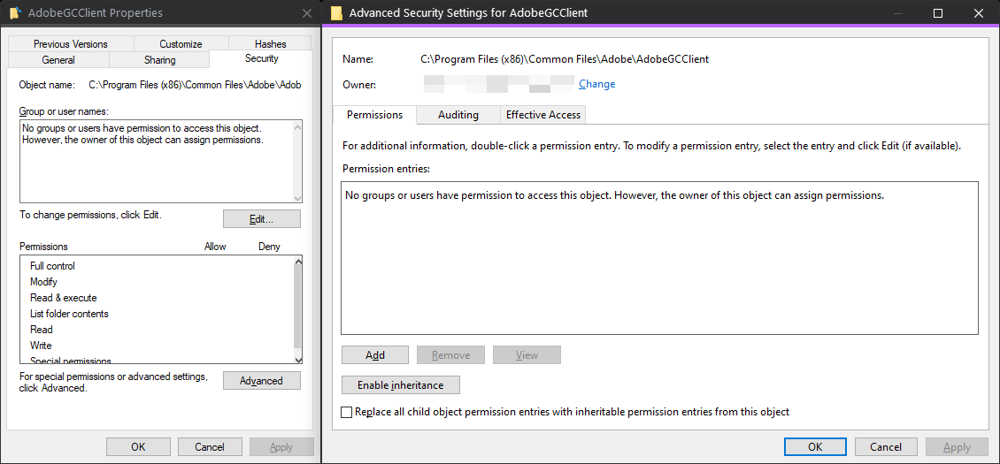

<h1 align="center">CC-Clean-Launcher - CC without the annoying background processes</h1>

## **Disclaimer:**
**All batch files must be within the same folder**

## Usage:

### 1:
- Under services, disable `Adobe Genuine Monitor Service (AGMService)` and `Adobe Genuine Software Integrity Service (AGSService)`
- And again under services, set `AdobeUpdateService` to manual 
- These will reset everytime you update your CC programs, so make sure to set it each time

### 2: 
- **Optional, but recommended:**
  * For a more permanent solution, you can delete all files in: `C:\Program Files (x86)\Common Files\Adobe\AdobeGCClient` 
  * Then remove all folder user permissions, including system, so that the files don't restore

  

  * The permanent solution only works for the AG services. The `AdobeUpdateService` is a necessary one, so just make sure to set it to manual each time you update any CC programs

<!-- ### 2:

- Make a backup folder for the following file (you could also rename them, although I prefer to have the backups centralized in a folder with specified path names as their folder paths)
- Go to: "C:\Program Files\Adobe\Adobe Creative Cloud Experience"

 - Cut CCLibrary.exe and paste it into your backup folder -->

### 3:

- Download the batch files for [CC 2021](https://github.com/brian6932/CC-Clean-Launcher/archive/refs/heads/main.zip) or [CC 2022](https://github.com/brian6932/CC-Clean-Launcher/archive/refs/heads/2022.zip)

### 4:

- Run `Creative_Cloud_Clean_Launcher.bat`
- Choose the program you want to open
  * After launching, You can optionally minimize the launcher

### 5:
- The launcher will kill some extra startup bloat, however, it will remain open. **DO NOT CLOSE IT!**
- It needs to kill the residual processes
- Do not close your CC program, kill it from task manager, or alternatively use something like [SuperF4](https://stefansundin.github.io/superf4/), if done correctly the launcher will subsequently close itself
